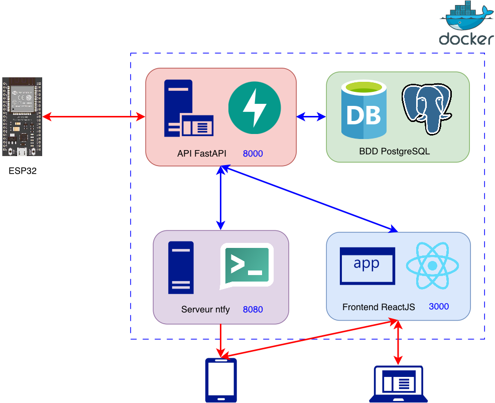
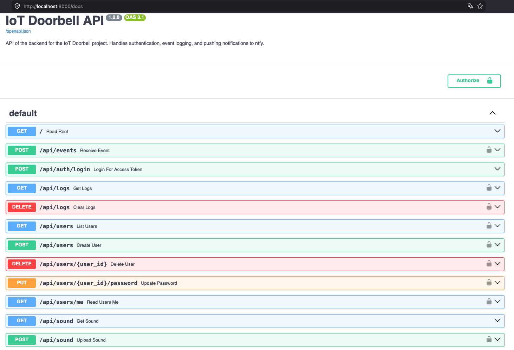
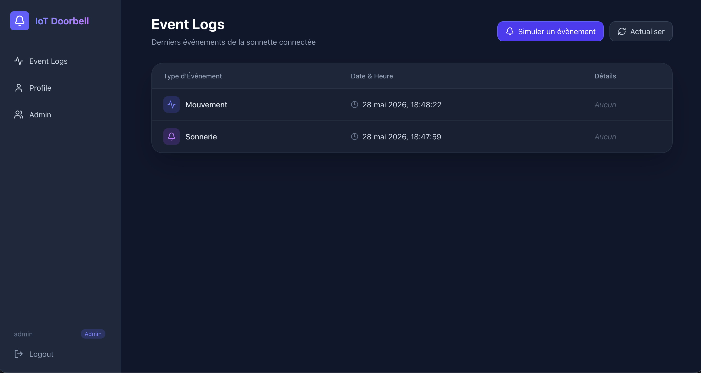
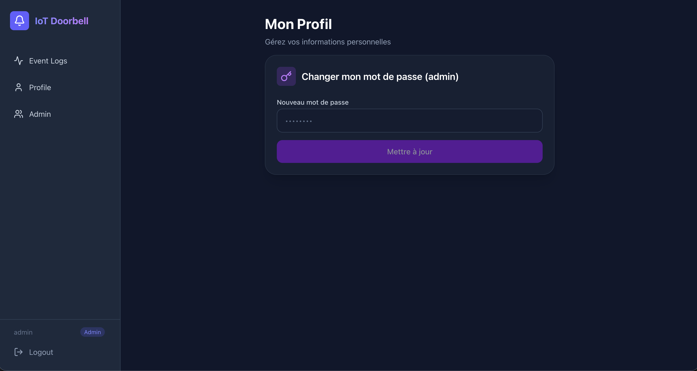
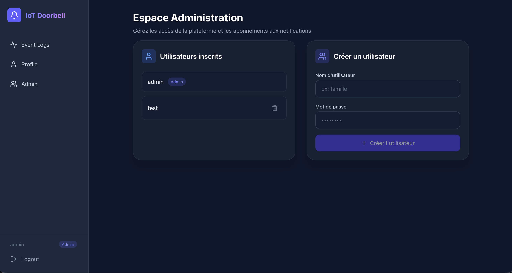
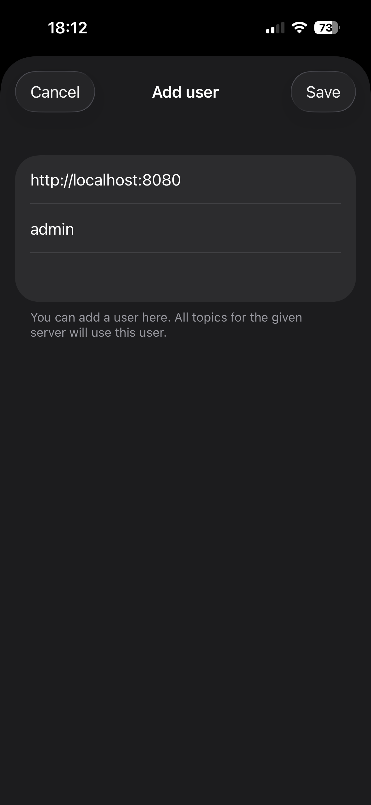
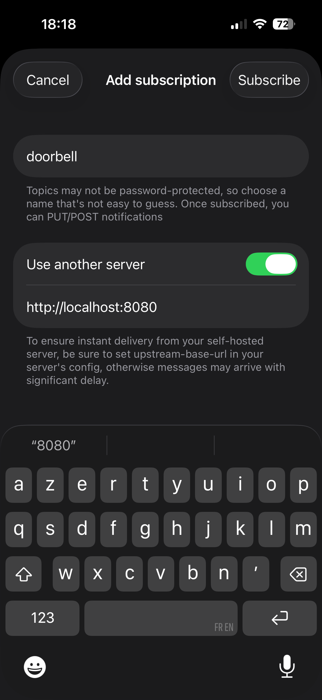
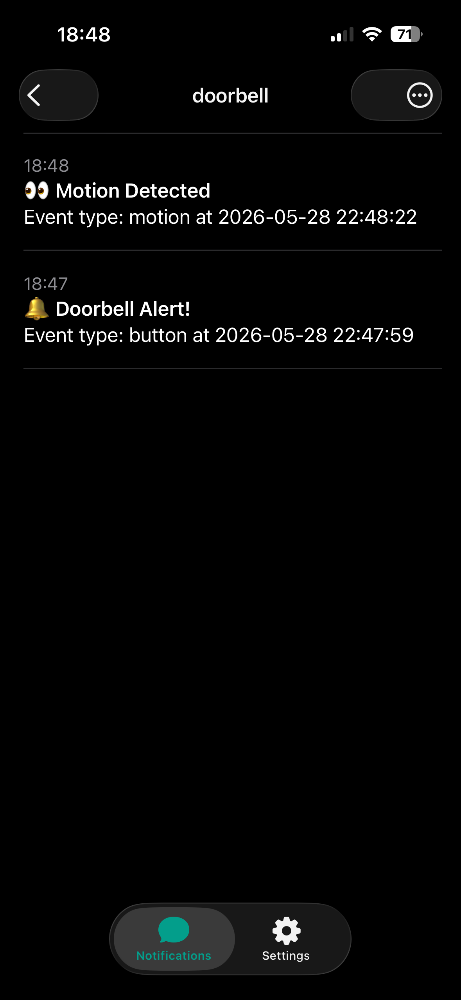

# Projet IoT - 8INF924

Auteurs : Cédric GAUTHERET, Vincent MONARQUE et Florian RIOTTE 


## Backend

Le backend de notre plateforme web joue le rôle de pivot central en orchestrant les communications entre l'ESP32, la base de données, l'interface d'administration et le serveur de notifications. Pour interagir avec la sonnette connectée de manière optimale, il expose une API spécifique qui reçoit les alertes de mouvement ou de pression du bouton. Afin de ne pas épuiser l'énergie de l'ESP32, le backend sécurise cet échange grâce à un jeton statique (API Key) inséré dans les en-têtes HTTP, ce qui évite les processus d'authentification lourds. Dès qu'un événement est validé, le backend se charge de l'enregistrer chronologiquement dans la base de données PostgreSQL et de relayer immédiatement l'information au serveur ntfy pour déclencher une notification push sur le téléphone de l'utilisateur.

En parallèle, le backend alimente le panneau d'administration destiné aux utilisateurs grâce à des routes API sécurisées par des jetons JWT. C'est à travers ces accès qu'il permet au frontend de récupérer l'historique des logs ou de gérer les comptes. 

Le backend se décompose en 4 parties :
- l'API Web (Python FastAPI)
- le frontend (React JS via Vite) permettant d'accéder à l'interface utilisateur
- la base de donnée PostgresSQL permettant de stocker les comptes utilisateurs et les logs de journalisation d'évènements envoyés par l'ESP32
- le serveur de notification (ntfy)

L'ensemble de la plateforme est intégré dans 4 conteneurs Docker respectifs.

Afin de sécuriser les connexions, les échanges entre les conteneurs se font via un réseau virtuel ``iot_network`` en mode *bridge*. Ce type de configuration évite les attaques de type "man in the middle" car les conteneurs ont un accès direct les uns entre les autres sans possibilité de voir le trafic sur ce réseau interne. 

Ainsi, les seules connexions qui se font sur le réseau WiFi sont entre le backend et l'ESP32 pour envoyer via une requête POST au déclenchement d'un évènement (mouvement capteur IR ou pression bouton), entre le backend et le navigateur de l'utilisateur qui veut consulter le frontend (authentification username/password), entre le serveur ntfy et l'application mobile ntfy sur le téléphone de l'utilisateur. 



### Quickstart Docker

Tout d'abord, il faut configurer les identifiants de la base de données Postgres, pour ce faire, copier le fichier à la racine ``.env.example`` en ``.env`` et changer le mot de passe de la base de données.

Pour lancer le projet au premier démarrage, il suffit d'exécuter la commande docker suivante :

```bash
docker compose up -d --build
```

Ensuite, on peut accéder aux routes suivantes :

- **API** ``http://localhost:8000``
- **Application WEB** ``http://localhost:3000``
- **Serveur ntfy** ``http://localhost:8080``

> Par défaut, le premier utilisateur créé est l'utilisateur ``admin`` dont le mot de passe est ``admin``.
Il est recommandé de changer ce mot de passe directement depuis le frontend sur l'application web.

### Utilisation API

> Les requêtes envoyés par l'ESP32 nécessitent une clée API. Celle-ci est stockée dans le fichier ``api/.env``.

Au démarrage, si aucun fichier ``api/.env`` n'existe, celui-ci sera créé automatiquement avec une clée API dans la variable ``ESP32_SECRET_TOKEN``, il est possible d'utiliser directement cette clée API (générée différement à chaque instanciation) ou bien d'en spécifier une dans le fichier.

Pour créer un nouvel évènement, il suffit d'envoyer une requête sur la route suivante : ``/api/events``

Les requêtes ont la forme suivante :

```bash
curl -X POST \
  -H "Authorization: Bearer <TOKEN>" \
  -H "Content-Type: application/json" \
  -d '{"event_type": "button"}' \
  http://localhost:8000/api/events
```

*Remplacer \<TOKEN> par la clée API dans le ``.env``*

On peut utiliser ``button`` ou ``motion`` comme type d'évènement et spécifier des informations supplémentaires via le paramètre ``details``.

C'est cette forme de requête qui est utilisée cotée ESP32.

La documentation de l'API est disponible à l'addresse suivante : ``http://localhost:8000/docs``



### Frontend - Application WEB

Une fois connecté au frontend, il est possible de voir l'historique des évènements sur la page d'accueil.



*La clée de chiffrement des tokens JWT peut être manuellement définie dans ``SECRET_KEY`` (``api/.env``).*

Il est possible d'accéder à l'onglet "Profile" pour modifier son propre mot de passe.

Le bouton "Effacer" permet tout simplement d'éffacer l'historique d'évènements de la page d'accueil.



En tant qu'administrateur, il est possible de se rendre dans l'onglet "Admin" pour ajouter ou supprimer de nouveaux utilisateurs.



Pour faciliter l'utilisation, le mot de passe de l'utilisateur ntfy et de l'application web sont synchronisés, ainsi, on ne passe que par le frontend pour créer des utilisateurs et modifier son mot de passe qui est automatiquement mis à jour du coté de ntfy. Ainsi, l'administration d'utilisateurs côté serveur ntfy est totalement transparente.

*Pour assurer la création de nouveau topic ntfy et la publication de message par le système sur ces topics, un utilisateur ntfy (``NTFY_SYSTEM_USER=system_backend``) est automatiquement créé par le système, ses credentials sont stockés dans le ``.env``.*

Ensuite, on a la possibilité dans la page admin de pouvoir définir un son comme sonnette via une requête POST.

Ce son pourra être joué sur l'ESP32 après avoir appuyer sur le bouton par exemple via la requête suivante 

```bash
curl -H "Authorization: Bearer <TOKEN>" http://localhost:8000/api/sound --output sonnette.mp3
```

### Notifications - ntfy

Pour utiliser ntfy, il suffit de télécharger l'application sur son téléphone [Get ntfy](https://ntfy.sh).

Une fois l'application ouverte, il faut se rendre dans "Settings" puis sur "+ Add user" et renseigner l'adresse du serveur (remplacer ``localhost`` par l'IP du serveur backend) ainsi que les informations d'identification de l'utilisateur.



Dans l'onglet "Notifications", il faut ensuite s'abonner au topic ``doorbell``.



On peut ensuite voir les notifications (et les recevoir sous forme de notifications push) dans le channel de message ainsi créé.

 

## Développement embarqué ESP32

Le développement embarqué a été réalisé avec Arduino IDE sur la carte FireBeetle ESP32-E v1.0.

Le code est disponible dans ``./Smartdoorbell``

Une base de firmware modulaire a été mise en place afin de séparer les responsabilités :

- initialisation générale du système
- gestion du bouton
- gestion des capteurs
- gestion du WiFi et des appels API

### Branchements réalisés

#### Câblage général

Pour simplifier le prototypage sur breadboard :

- la broche 3V3 du FireBeetle ESP32 alimente le rail positif de la breadboard
- une broche GND du FireBeetle alimente le rail de masse
- chaque module est ensuite relié :
  - au rail +
  - au rail GND
  - à une broche d'entrée/sortie de l'ESP32 pour son signal

#### Breadboard

Le montage est réalisé sur breadboard selon le principe suivant :

- la carte ESP32 est placée de manière à accéder facilement aux broches
- les rails latéraux servent à distribuer l'alimentation
- les modules sont branchés un par un pour valider leur fonctionnement avant intégration complète

#### Bouton poussoir DFR0029
Le bouton poussoir est utilisé en tant que sonette.

Branchement utilisé :

- VCC → alimentation
- GND → masse
- OUT / SIG → D6 sur le FireBeetle ESP32-E

Ce capteur permet de générer un évènement de type button.

#### Capteur IR SEN0018
Le capteur IR est utilisé pour de la détection de présence / mouvement.

Branchement utilisé :

- VCC → alimentation
- GND → masse
- OUT / SIG → D5 sur le FireBeetle ESP32-E

Ce capteur permet de générer un évènement de type motion.

#### Capteur de son DFR0034
Le capteur de son a été envisagé pour détecter un niveau sonore local.

Branchement utilisé :

- VCC → alimentation
- GND → masse
- A → entrée analogique A5 sur le FireBeetle ESP32-E pour mesurer le niveau sonore

Ce capteur permet de mesurer le niveau sonore 

## PCB
Pour voir le PCB, il faut copier le dossier dans votre répertoire de projet EasyEDA. Il devrait ensuite apparaître dans le menu de vos projets à gauche. Si, en cliquant sur le PCB, certaines composantes ne s’affichent pas immédiatement, changer la vue des couches permet généralement de les faire apparaître.